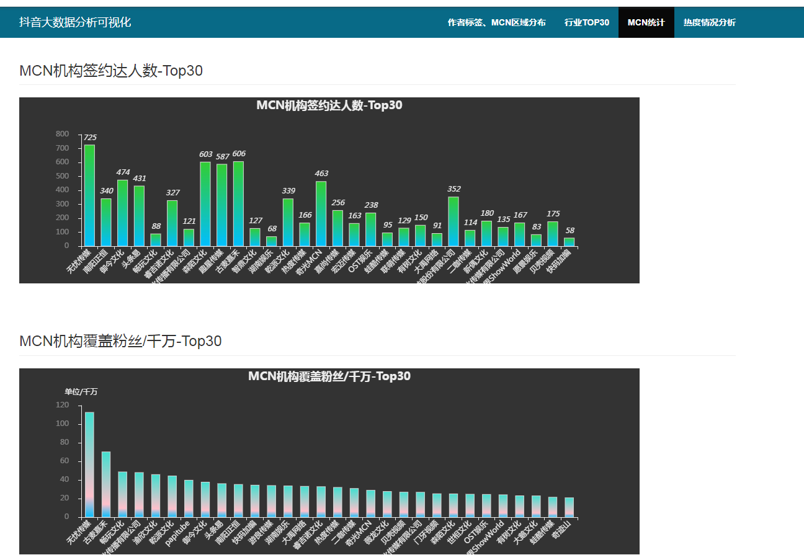
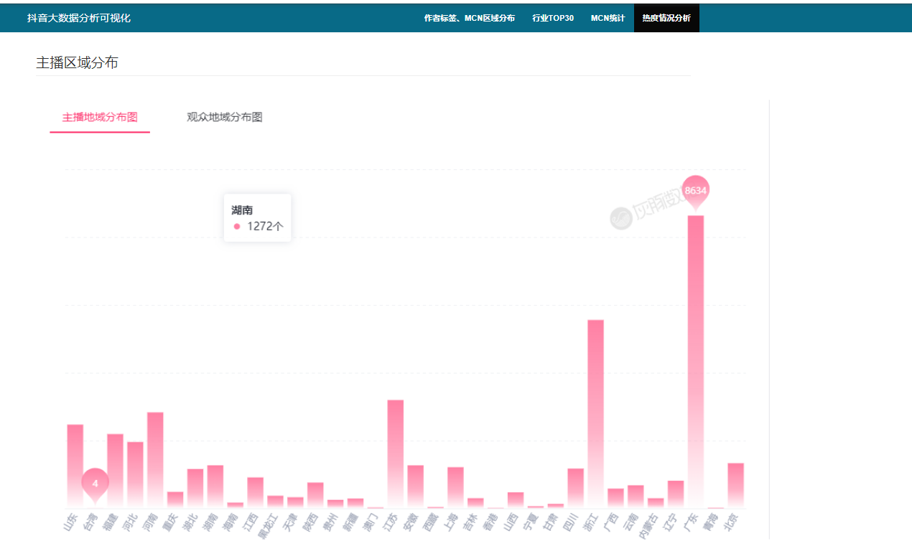

## 计算机毕业设计Python抖音可视化 抖音大数据分析 抖音爬虫 抖音用户行为分析 抖音大数据 Hadoop Spark 数据仓库 推荐系统 机器学习 深度学习 机器学习 Scrapy爬虫 协同过滤推荐算法 混合神经网络推荐算法 PySpark Hadoop Hive Hadoop PySpark 机器学习 深度学习 Python Scrapy分布式爬虫 机器学习 大数据毕业设计 数据仓库 大数据毕业设计 文本分类 LSTM情感分析 大数据毕业设计 知识图谱 大数据毕业设计 预测系统 实时计算 离线计算 数据仓库 人工智能 神经网络

## 要求
### 源码有偿！一套(论文 PPT 源码+sql脚本+教程)

### 
### 加好友前帮忙start一下，并备注github有偿纯python抖音分析
### 我的QQ号是2827724252或者798059319或者 1679232425或者微信:bysj2023nb 或bysj1688

# 

### 加qq好友说明（被部分 网友整得心力交瘁）：
    1.加好友务必按照格式备注
    2.避免浪费各自的时间！
    3.当“客服”不容易，repo 主是体面人，不爆粗，性格好，文明人。

演示视频

https://www.bilibili.com/video/BV1cm421G7xj/?spm_id_from=333.999.0.0

本项目是大数据—基于抖音用户数据集的可视化分析。抖音作为当下非常热门的短视频软件，其背后的数据有极高的探索价值。本项目根据1737312条用户行为数据，利用python工具进行由浅入深的内容分析，目的是挖掘其中各类信息，更好地进行内容优化、产品运营

